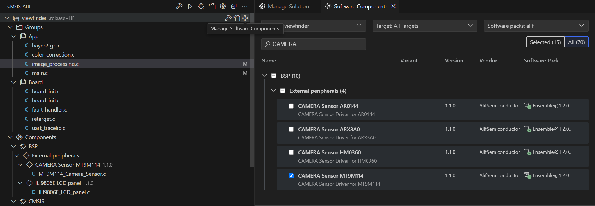

# Viewfinder demo application

This application is built on VSCode Getting Started Template (alif_vscode-template)
The default hardware is Gen 2 Ensemble DevKit with camera module and display.

**NOTE:** To change the target board set BOARD_ALIF_DEVKIT_VARIANT in board/board.h
For example AppKit gen2
#define BOARD_ALIF_DEVKIT_VARIANT       5

**NOTE:** Ensemble DevKits do not ship with a camera and display by default. Please contact Alif to request.

Camera modules supported by the demo application are:
- MT9M114 **This is the default camera**
- ARX3A0 **This camera module has also been shipped with Alif Semiconductor kits**

You can change the camera module in the project by commenting|uncommenting camera component in `viewfinder.cproject.yaml`
```
    - component: AlifSemiconductor::BSP:External peripherals:CAMERA Sensor MT9M114
    # - component: AlifSemiconductor::BSP:External peripherals:CAMERA Sensor ARX3A0
```

Choosing the camera module can be done using the csolution GUI by clicking "Manage Software Components" and searching with CAMERA.
Remember to click "ALL" to see the unselected camera modules.



## Demo application
The application initializes the camera and display modules and starts capturing frames
in a single-frame mode. Each captured frame is processed through bayer-to-RGB and
white balance before rescaling the captured frame to display buffer.
While running, the green LED blinks (on DevKit). Profiling information is printed to UART.
In error case the red LED is set.

## Quick start
First clone the project repository
```
git clone git@github.com:alifsemi/alif_M55-viewfinder.git
cd alif_M55-viewfinder
git submodule update --init
```

To build the application for a supported board other than the DevKit, you have to update the `board.h` file to pick the right variant of the board.
By default the template will build for gen2 DevKit.

The required software setup consists of *VS Code*, *Git*, *CMake*, *Ninja build system*, *cmsis-toolbox*, *Arm GNU toolchain* and *Alif SE tools*.
By default the template project uses J-link so *J-link software* is required for debugging.
In addition to build tools the VS Code extensions and CMSIS packs will be downloaded automatically during the process.

To make environment setup easier this project uses *Arm Environment Manager* for downloading and configuring most of the tool dependencies.
Basically only VS Code, Alif SE tools and J-Link software need to be downloaded and installed manually.

Opening the project folder with VS Code automatically suggests installing the extensions needed by this project:
- Arm Environment Manager
- Arm CMSIS csolution
- Cortex-Debug
- Microsoft C/C++ Extension Pack

After setting up the environment you can just click the CMSIS icon and then the *context* and *build* icon to get going.

For Alif SE tools and J-link debugging support add the following entries to VS Code user settings.json (Press F1 and start typing 'User')
```
{
    "alif.setools.root" : "C:/alif-se-tools/app-release-exec",
    "cortex-debug.JLinkGDBServerPath": "C:/Program Files/SEGGER/JLink/JLinkGDBServerCL.exe"
}
```

## More detailed getting started guide
Please refer to the template project's [Getting started guide](https://github.com/alifsemi/alif_vscode-template/blob/master/doc/getting_started.md)

## Guides for integrating a new camera or display panel
[Custom camera module driver howto](doc/camera_module.md)

[Integrating new panel and sensor](doc/integrating_new_panel_and_sensor.md)
